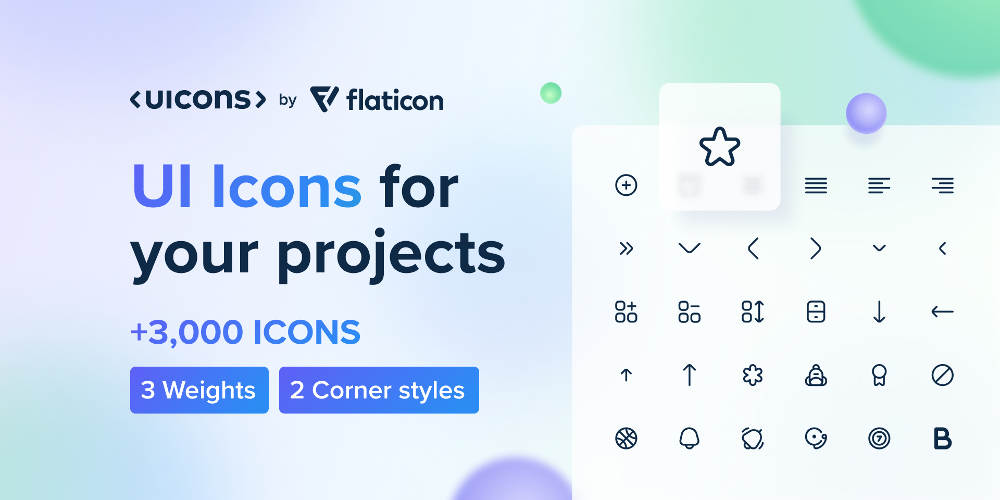

# Documentation 

The Iconic package provides a collection of icons that can be easily integrated into your Flutter applications. With a simple installation process and intuitive usage, you can enhance your app's user interface by incorporating eye-catching icons.

The icons included in the Iconic package are designed by [FreePik](https://www.freepik.com/) and [Flaticons](https://www.flaticon.com/free-icons/ui). These icons are original creations and are provided as part of the Iconic package to enhance the visual appeal of your Flutter applications.

to see all the icons included in the package, [click here](https://www.flaticon.com/icon-fonts-most-downloaded)
## Installing

Include Iconic in your pubspec.yaml file:
```dart
dependencies:
  iconic: ^0.0.1
```
If your IDE doesn't do it automatically, run:
```dart
flutter pub get
```

## Using

Import the package in your Flutter file and use Icon to get the actual icon widget:
```dart
import 'package:iconic/iconic.dart';

Icon(Iconic.home);

```


## Sample
```dart
import 'package:flutter/material.dart';
import 'package:iconic/iconic.dart';

void main() => runApp(MyApp());

class MyApp extends StatelessWidget {
  @override
  Widget build(BuildContext context) {
    return MaterialApp(
      theme: ThemeData(
        primarySwatch: Colors.blue,
      ),
      home: MyHomePage(title: 'Iconic Demo Home Page'),
    );
  }
}

class MyHomePage extends StatefulWidget {
  MyHomePage({Key key, this.title}) : super(key: key);
  final String title;

  @override
  _MyHomePageState createState() => _MyHomePageState();
}

class _MyHomePageState extends State<MyHomePage> {
  @override
  Widget build(BuildContext context) {
    return Scaffold(
      appBar: AppBar(
        title: Text(widget.title),
      ),
      body: Center(
        child: Column(
          children: [
            Text(
              'Icons are great!',
            ),
            Row(
              mainAxisSize: MainAxisSize.min,
              crossAxisAlignment: CrossAxisAlignment.center,
              children: [
                Column(
                  children: [
                    Icon(Iconic.heart),
                  ],
                ),
              ],
            ),
          ],
        ),
      ),
    );
  }
}
```
